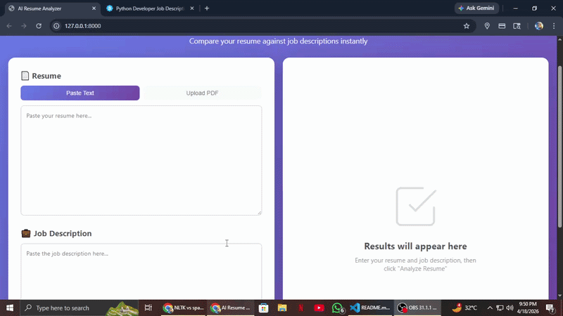

# AI Resume Analyzer

An intelligent resume screening system that compares resumes against job descriptions using NLP, machine learning, and semantic analysis.




---

## Table of Contents

- [Overview](#-overview)
- [Features](#-features)
- [System Architecture](#-system-architecture)
- [Installation](#-installation)
- [Usage](#-usage)
- [How It Works](#-how-it-works)
- [Technology Stack](#-technology-stack)
- [Project Structure](#-project-structure)
- [Scoring Methodology](#-scoring-methodology)
- [Limitations](#-limitations)
- [Future Improvements](#-future-improvements)
- [Contributing](#-contributing)

---

## 🌟 Overview

AI Resume Analyzer is a **ATS (Applicant Tracking System)** that automates resume screening by analyzing:

- **Skills Match**: 220+ technical skills across mutiple domains
- **Education Compatibility**: Degree hierarchy and field relatedness
- **Semantic Similarity**: Hybrid SBERT + TF-IDF approach

**Use Cases:**
- Job seekers optimizing resumes for specific roles
- Recruiters screening candidates efficiently
- HR teams standardizing evaluation criteria
- Students learning about ATS systems

---

## ✨ Features

### Core Capabilities

✅ **Multi-Domain Skill Extraction**
- Tech (Python, React, Docker, etc.)
- Data Science (Tableau, Power BI, SQL)
- Finance (QuickBooks, SAP, Bloomberg)
- UI/UX (Figma, Sketch, Wireframing)
- Customer Service (CRM, Salesforce, Zendesk)

✅ **Education Analysis**
- 5 degree levels (PhD → High School)
- 46+ fields of study
- Field relatedness scoring
- Degree hierarchy comparison

✅ **Semantic Understanding**
- SBERT embeddings for context
- TF-IDF for keyword matching
- Hybrid 70/30 weighted scoring
- Handles synonyms and variations

✅ **File Support**
- PDF, DOCX, TXT uploads
- Drag-and-drop interface
- Text paste option
- 5MB file limit

✅ **Modern UI**
- Split-panel layout
- Real-time analysis
- Persistent results
- Responsive design

---

## 🏗️ System Architecture

```
┌─────────────────────────────────────────────────────────┐
│                    User Interface (Frontend)            │
│              HTML + CSS + JavaScript (AJAX)             │
└────────────────────┬────────────────────────────────────┘
                     │
                     ↓
┌─────────────────────────────────────────────────────────┐
│                  Django Backend (API)                   │
└────────────────────┬────────────────────────────────────┘
                     │
        ┌────────────┴────────────┐
        │                         │
        ↓                         ↓
┌──────────────────┐    ┌──────────────────┐
│  PDF Extractor   │    │  Analyzer Engine │
│  (pdfplumber)    │    │                  │
└──────────────────┘    └────────┬─────────┘
                                 │
                    ┌────────────┼────────────┐
                    │            │            │
                    ↓            ↓            ↓
            ┌──────────┐  ┌──────────┐  ┌──────────┐
            │  Skills  │  │Education │  │Similarity│
            │  Module  │  │  Module  │  │  Module  │
            └──────────┘  └──────────┘  └──────────┘
                    │            │            │
                    └────────────┼────────────┘
                                 │
                                 ↓
                         ┌──────────────┐
                         │    Result    │
                         │   (JSON)     │
                         └──────────────┘
```

---

## 🚀 Installation

### Prerequisites

- Python 3.8+
- pip
- Virtual environment (recommended)

### Step 1: Clone Repository

```bash
git clone https://github.com/yourusername/resume-analyzer.git
cd resume-analyzer
```

### Step 2: Create Virtual Environment

```bash
python -m venv venv
source venv/bin/activate  # On Windows: venv\Scripts\activate
```

### Step 3: Install Dependencies

```bash
pip install -r requirements.txt
```

**Requirements:**
```
Django==6.0.4
nltk==3.9.4
pdfplumber==0.11.9
regex==2026.4.4
scikit-learn==1.8.0
sentence-transformers==5.4.1
python-docx==1.2.0

```

### Step 4: Download NLTK Data

```python
python -c "import nltk; nltk.download('punkt'); nltk.download('stopwords'); nltk.download('wordnet'); nltk.download('averaged_perceptron_tagger')"
```

### Step 5: Run Migrations

```bash
python manage.py migrate
```

### Step 6: Start Server

```bash
python manage.py runserver
```

Visit: `http://localhost:8000`

---

## 📖 Usage

### Web Interface

1. **Open the application** in your browser
2. **Choose input method**:
   - Paste resume text directly
   - Upload PDF/DOCX/TXT file
3. **Paste job description** in the right textarea
4. **Click "Analyze Resume"**
5. **View results** in the right panel:
   - Overall match score
   - Skills breakdown (matched/missing/extra)
   - Education compatibility
   - Similarity metrics

## 🔍 How It Works

### 1. Skills Extraction

**Method**: Alias-based pattern matching with word boundaries

```python
# Example
Resume: "Proficient in Python, ML, and REST APIs"
JD: "Looking for machine learning and Python experience"

Extracted:
- Resume: {python, machine learning, rest api}
- JD: {python, machine learning}
- Matched: {python, machine learning}
- Score: 100%
```

**Synonym Handling**:
- "ML" → "machine learning"
- "JS" → "javascript"
- "AWS" → "amazon web services"

### 2. Education Scoring

**Degree Hierarchy**:
```
PhD (4) > Masters (3) > Bachelors (2) > Diploma (1) > High School (0)
```

**Field Relatedness**:
```
Same field (CS vs CS)           → 100%
Same group (ECE vs CS - both tech) → 75%
Adjacent group (Math vs CS)     → 40%
Unrelated (History vs CS)       → 15%
```

**Final Education Score**:
```
70% * Degree Score + 30% * Field Score
```

### 3. Semantic Similarity

**Hybrid Approach**:

```python
# SBERT (Semantic)
embeddings = model.encode([resume, jd])
sbert_score = cosine_similarity(embeddings)

# TF-IDF (Keywords)
vectors = vectorizer.fit_transform([resume, jd])
tfidf_score = cosine_similarity(vectors)

# Combined
similarity = 0.7 * sbert_score + 0.3 * tfidf_score
```

### 4. Final Composite Score

```python
final_score = (
    0.50 * skill_score +
    0.30 * education_score +
    0.20 * similarity_score
)
```

**Rationale**:
- Skills weighted highest (direct requirement match)
- Education moderate weight (qualification baseline)
- Similarity lowest (holistic context check)

---

## 🛠️ Technology Stack

| Component | Technology |
|-----------|------------|
| **Backend Framework** | Django 4.0+ |
| **PDF Extraction** | pdfplumber |
| **NLP Preprocessing** | NLTK |
| **Semantic Similarity** | Sentence Transformers (SBERT) |
| **Keyword Matching** | Scikit-learn (TF-IDF) |
| **Frontend** | HTML5, CSS3, Vanilla JavaScript |
| **HTTP Client** | Fetch API (AJAX) |

**ML Models Used**:
- `all-MiniLM-L6-v2` (SBERT) - 384-dimensional embeddings
- `TfidfVectorizer` (scikit-learn) - keyword extraction

---

## 📁 Project Structure

```
resume_analyzer/
├── analyzer_app/
│   ├── templates/
│   │   └── index.html           # Main UI
│   ├── static/
│   │   ├── css/
│   │   │   └── style.css        # Styling
│   │   └── js/
│   │       └── script.js        # Frontend logic
│   ├── analyzer.py              # Core orchestrator
│   ├── skills.py                # Skills extraction
│   ├── skill_library.py         # 220+ skills database
│   ├── education.py             # Education analysis
│   ├── education_library.py     # Degree/field database
│   ├── similarity.py            # SBERT + TF-IDF
│   ├── preprocess.py            # Text preprocessing
│   ├── pdf_extractor.py         # File parsing
│   ├── views.py                 # Django views
│   └── urls.py                  # URL routing
├── manage.py
├── requirements.txt
└── README.md
```

---

## 📊 Scoring Methodology

### Skills Score Calculation

```
Matched Skills Count / JD Required Skills Count × 100
```

**Example**:
```
JD requires: Python, Docker, AWS (3 skills)
Resume has: Python, Docker (2 skills)
Score: 2/3 × 100 = 66.67%
```

### Education Score Breakdown

```python
# Degree comparison (70% weight)
if resume_degree_level >= jd_degree_level:
    degree_score = 100
else:
    degree_score = (resume_level / jd_level) × 100

# Field comparison (30% weight)
field_score = relatedness_score(resume_field, jd_field)

# Final
education_score = 0.7 * degree_score + 0.3 * field_score
```

### Similarity Score Calculation

```python
# Section extraction
resume_context = extract_experience + extract_projects + extract_skills

# Preprocessing
cleaned_resume = lemmatize(remove_stopwords(tokenize(resume_context)))
cleaned_jd = lemmatize(remove_stopwords(tokenize(jd)))

# TF-IDF
tfidf_vectors = TfidfVectorizer().fit_transform([cleaned_resume, cleaned_jd])
tfidf_score = cosine_similarity(tfidf_vectors[0], tfidf_vectors[1])

# SBERT
embeddings = SentenceTransformer.encode([resume_context, jd])
sbert_score = cosine_similarity(embeddings[0], embeddings[1])

# Hybrid
similarity_score = 0.7 * sbert_score + 0.3 * tfidf_score
```

---

## ⚠️ Limitations

### Current Constraints

1. **No Experience Module** (planned future addition)
   - Cannot extract years of experience
   - No job title seniority detection
   - No company ranking consideration

2. **Skills Extraction**
   - Limited to predefined library (220+ skills)
   - No context understanding ("basic Python" vs "expert Python")
   - Emerging skills must be manually added

3. **Education Extraction**
   - Fails on creative resume formats
   - No GPA/percentage extraction
   - No university ranking consideration

4. **File Parsing**
   - Not proper handling of heavily formatted PDFs
   - No image-based resume support (OCR needed)

5. **Scale**
   - Single resume processing only
   - No batch candidate ranking
   - No database persistence

### Known Edge Cases

- Resumes without section headers may produce inaccurate results
- Non-English resumes not supported
- Skills written as images won't be detected
- Overlapping work experience dates not handled

---

## 🚀 Future Improvements

### Planned Features

- [ ] **Experience Module**: Date extraction + duration calculation
- [ ] **SkillNER Integration**: Automatic skill detection using NER
- [ ] **Database**: Save analysis history with SQLite/PostgreSQL
- [ ] **Batch Processing**: Upload multiple resumes, rank candidates
- [ ] **Export**: PDF/CSV reports
- [ ] **User Authentication**: Save preferences and history
- [ ] **Resume Optimizer**: Suggest improvements to increase score
- [ ] **ATS Compliance Checker**: Format and keyword analysis

### Long-term Vision

- Multi-language support (Spanish, French, Hindi)
- Video resume analysis
- Chrome extension for LinkedIn/Naukri
- Mobile app (React Native)
- Job recommendation engine
- Interview question generator based on skills gap

---

## 🤝 Contributing

Contributions are welcome! Here's how you can help:

1. **Fork the repository**
2. **Create a feature branch** (`git checkout -b feature/AmazingFeature`)
3. **Commit changes** (`git commit -m 'Add AmazingFeature'`)
4. **Push to branch** (`git push origin feature/AmazingFeature`)
5. **Open a Pull Request**

### Areas Needing Help

- Expanding skill library (especially non-tech domains)
- Adding support for more resume formats
- Improving PDF extraction accuracy
- Building experience extraction module
- Writing unit tests
- Documentation improvements

---

## 📧 Contact

**Author**: Tushar 
**Email**: rudrahpratap@gmail.com 
**GitHub**: https://github.com/Rudrah001

---

## 🌟 Star History

If you find this project helpful, please consider giving it a star ⭐

---

**Built with ❤️ for making resume screening smarter and fairer**
